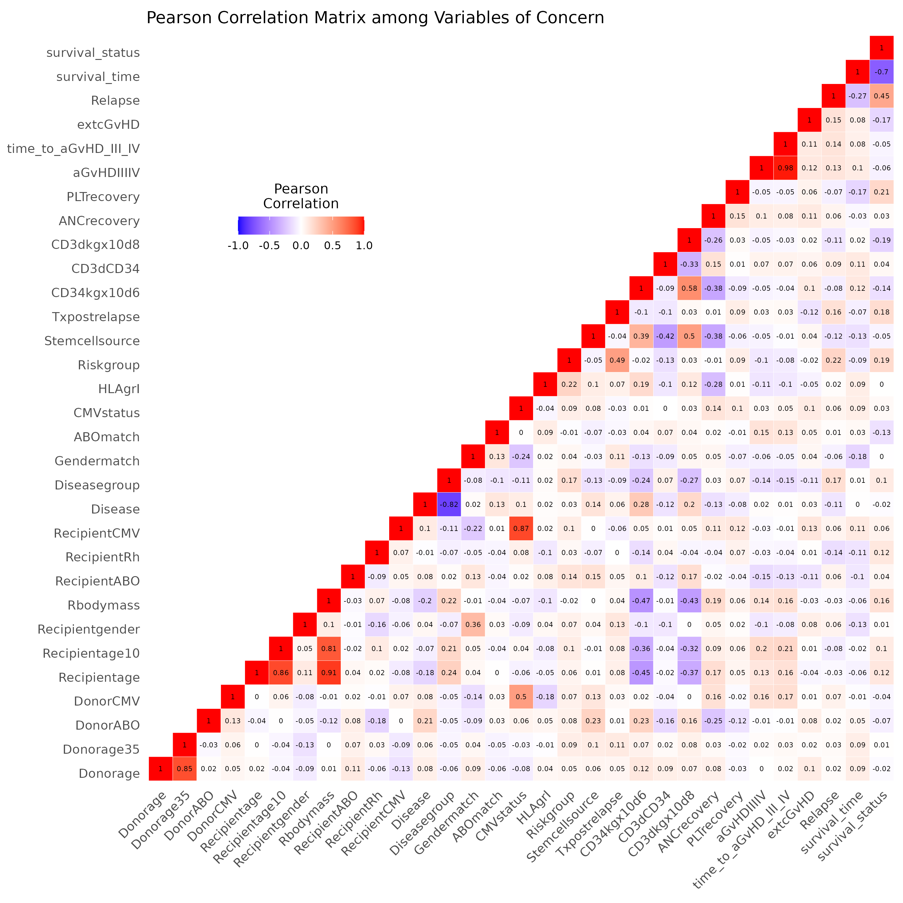

# Analysis of Children bone marrow Transplant Data set

## Introduction

### Background

bone marrow transplants are a standard treatment for acute leukemia. Recovery following bone marrow transplantation is a complex process. Prognosis for recovery may depend on risk factors known at the time of transplantation, such as patient and/or donor age and sex, the stage of initial disease, the time from diagnosis to transplantation, etc. The final prognosis may change as the patients post transplantation history develops with the occurrence of events at random times during the recovery process, such as development of acute or chronic graft-versus-host disease (GVHD), return of the platelet count to normal levels, return of granulocytes to normal levels, or development of infections. Transplantation can be considered a failure when a patients leukemia returns (relapse) or when he or she dies while in remission (treatment related death).

It is of significant importance to find matched donor such that ensure success outcome and reduce the risk of complications like graft-versus host disease after transplantation procedure. In general, Human Leukocyte Antigens (HLA) Matching is conducted to find out if hematopoietic stem cells match between the donor and the patient receiving the transplant. However, due to the difficulty and time consuming to find a fully matched donor, it is acceptable to use unrelated donors mismatched at 1-2 HLA alleles. Previous research also proposed that increased dosage of CD34+ cells / kg extends overall survival time without simultaneous occurrence of undesirable events affecting patients' quality of life (Kawak et al., 2010).To study the recovery process after children bone marrow transplantation, we carry out a survival analysis among a cohort of children who received transplantation treatment. Potential significant factors for children's survival after transplantation are investigated.

### Data Description

This data set describes pediatric patients with several hematologic diseases grouped into malignant disorders and nonmalignant. All patients were subject to the unmanipulated allogeneic unrelated donor hematopoietic stem cell transplantation. A total of 187 patients are included in this data set. And 39 attributes about donor and recipient's matching properties and their survival outcomes after transplantation are recorded.

## Methods

Prior to carrying out any model building or prediction on the bone marrow transplant data, we do some exploratory analysis by covariates. Summary statistics (average and standard deviation for continuous variables, count and percentage for categorical variables) of each potential factor for survival status are calculate overall and by survival status during the study period. To test the differences in those factors between different survival statistics, we employed Wilcoxon rank sum test for continuous variables and Pearson;s Chi-squared test for categorical variables.

And we also calculated the Pearson's correlation efficient value among those potential covariates.

For those covariates significantly associated with survival status, we proceed to survival analysis. To test the effect of these potential factors on the survival time after bone marrow transplant, we first apply a log-rank test for each covariate with respect to children's survival time after transplantation. The null hypothesis is that there is no significant difference in children's survival after transplantation between different levels of these factors, which can be writen as: $H_0:S_1 (t)=S_2 (t)$ for all t, where $S_j (t)$ be the survival function of patients in level j. $H_1:S_1 (t)≠S_2 (t)$

We fit a cox proportional hazards model to predict disease free survival of future patients. For the full model, we use time of children's survival after bone marrow transplantation as outcome, and potential covariates include disease group, information on acute graft-versus-host disease (GVHD) status, chronic graft-versus-host disease status, informatoin on whether platelets returned to normal level, patients' age, patients' gender patients' body mass and dosage of CD34+ cells. The fitted model can be expressed in the form: \$ λ(t)= λ_0 (t)exp(βX) \$ where $λ(t)$ is the hazard function for disease free survival after transplantation, $β$ is a vector of unknown parameters and X are values of associated covariates. We make proportional hazard assumption while fitting this model and use backward selection method for variable selection.

## Results

### Exploratory Analysis

The summary statistics grouped by survival status are shown in Table1 (1-dead during the study period after transplantation; 0-otherwise). From these results, Patients' age, body mass, disease type, risk group, the CD34 cells, chronic graft-versus-host disease status, platelet recovery and ANC recovery are significantly associated with the overall survival outcome during the study period.

The heatmap for Pearson's correlation coefficients are shown in Figure 1. There are no significant association among these identified covariates. Therefore, we can proceed to further survival analysis. 

### Log-Rank Test

In order to compare the disease free survival after bone marrow transplant between the age groups, we firstly plot Kaplan-Meier estimated survival functions by age, as shown in Figure 2. From the K-M plots, there are differences in survival probability among these disease groups. children with age \< 10 have the higher estimated survival probability during the study period compared with children with age \> 10. By logrank test, the test statistic is chi-square = 4.5 with associated p-value = 0.03 \< 0.03. Therefore, we reject the null hypohthesis and conclude that there is significant effect of children's age on the survival after transplantation.

Similar as for age, from the K-M curves, children had Neutrophils recovery after bone marrow transplantation showed higher survival probability during the study period. By log-rank test, the test statistic is 285 with p \< 0.0001. We reject the null hypothesis and conclude that there are significant effect of Neutrophils recovery on survivals.

For platelet recovery, from the K-M curves, children had platelet recovery after bone marrow transplantation showed higher survival probability during the study period. By log-rank test, the test statistic is 116 with p \< 0.0001. We reject the null hypothesis and conclude that there are significant effect of platelet recovery on survivals.

For development of acute graft versus host disease, from the K-M curves, children without acute GvHD after bone marrow transplantation showed higher survival probability during the study period. By log-rank test, the test statistic is 4.7 with p = 0.03. We reject the null hypothesis and conclude that there are significant effect of acyte GvGD development on survivals after transplantation.

For development of extensive chronic graft versus host disease , from the K-M curves, children without chronic GvHD after bone marrow transplantation showed higher survival probability during the study period. By log-rank test, the test statistic is 10.2 with p = 0.001. We reject the null hypothesis and conclude that there are significant effect of extensive chronic GvHD on survival after transplantation.

### Cox Proportional Hazard Model

After backward variable selection procedure, the selected covariates of the final model for children's survival after bone marrow transplantation include children's risk group, CD3+ cell dose, platelet recovery and extensive chronic GvHD. The parameter estiamtes of the fitted cox model are shown in Table 2. The estimated hazard ratios for platelet recovery is 0.098 (95% CI: 0.032, 0.296), suggesting that the hazard rate for those children without platelet recovery after transplantation is about 9.8% the hazard rate for those with platelet recovery.

## Resource

[Github Repository] (<https://github.com/Wanting-Jin/bios-611-project/>)
